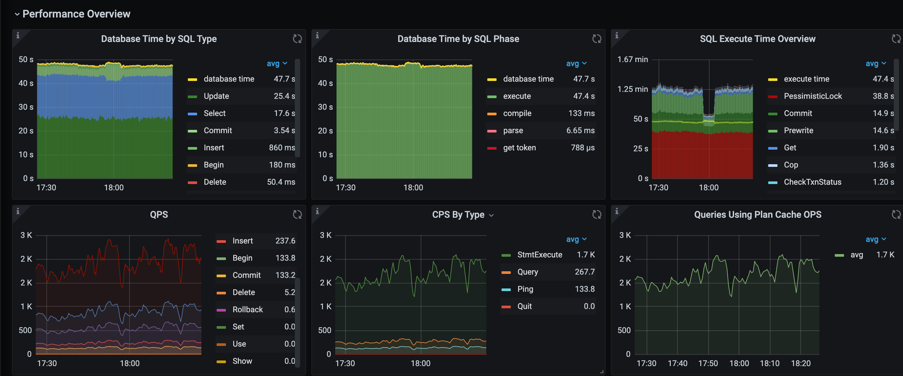

# What is SmartTune?
SmartTune is a black-box optimization that can automatically find good performance settings for a complex system's configuration knobs. 
It consists of two parts: client and server. When deploying the system, which makes it easier for users to find better performance settings.
Many complex systems have hundreds or even thousands of configuration knobs, Manual tuning can be time-consuming and expertise dependent.
SmartTune can quickly find better settings by using AI methods without manual intervention. So far, SmartTune supports configuration tuning of
TiDB@v6.1.0, and it's very easy to extend to other complex systems.

# Quick start
If you want to quick start, try the following commands, enjoy it!
### Start server
Server can be complied and used on Linux, CentOS. Python(>=3.6.0) is requirement, It is as simple as:
```shell
$ make
python3 setup.py bdist_wheel
running bdist_wheel
...
adding 'smarttune-0.0.1.dist-info/top_level.txt'
adding 'smarttune-0.0.1.dist-info/RECORD'
removing build/bdist.macosx-10.14.6-arm64/wheel
cp dist/*.whl ./
```
It is very easy to install the server, the command is as follows:
```shell
$ pip3 install smarttune-0.0.1-py3-none-any.whl
Processing /root/develop/smarttune/smarttune-0.0.1-py3-none-any.whl
Collecting scikit-learn==0.19.1
...
Successfully installed smarttune-0.0.1
```
Run the following command to start the server:
```shell
$ smarttune --config=/root/config.json
* Serving Flask app 'app' (lazy loading)
* Environment: production
...
INFO:werkzeug: * Running on http://172.16.7.68:5000/ (Press CTRL+C to quit)
```
The contents of config.json are as follows:
```json
{
    "db_url": "mysql://<username>:<password>@127.0.0.1:3306/smarttune",
    "testing": false
}
```
The 'db_url' specifies the url of mysql to store metadata.

### Start client
Client can be complied and used on Linux, CentOS and OSX. Golang(>=1.18.0) is requirement, It is as simple as:
```shell
$ cd client
$ make
start to build smartctl
GO111MODULE=on go build  -tags codes -o ./bin/smartctl cmd/smartctl/*.go
build smartctl successfully
```
An example of tuning TiDB@v6.1.0 is as follows:
```shell
$ ./bin/smartctl register tidb@v6.1.0 --backend=172.16.7.68:5000
Success to register TiDB@v6.1.0

$ ./bin/smartctl create tidb-tuning --backend=172.16.7.68:5000
Success to create session 'tidb-tuning' for TiDB@v6.1.0

$ ./bin/smartctl run tidb-tuning --backend=172.16.7.68:5000 --url="root:@tcp(172.16.7.68:3390)/test" --cluster_name=debug
The 1-th Loop Starts / Total Loops 10
Start to collect knobs
Start the first collection for metrics
Start the second collection for metrics
Result stored successfully! Running tunner with result id: 1
Recommend the next configuration:
{
    "tidb.performance.distinct-agg-push-down": true,
    "tidb.performance.gogc": 171,
    "tidb.tikv-client.copr-cache.capacity-mb": 2111.314,
    "tidb.tikv-client.grpc-connection-count": 13,
    "tidb.token-limit": 3416,
    "tidb_build_stats_concurrency": 140,
    "tidb_committer_concurrency": 991,
    "tidb_distsql_scan_concurrency": 166,
...
```
It's very easy to tune TiDB@v6.1.0 based on Client.
# Evaluation
Deploy the TiDB cluster locally and tune the TPCC workload online. Compared with the default knobs, the tuning knobs increase
QPS by **41.9%(1753->2487)** and reduce latency by **27.4%(25.9ms->18.8ms)**. The experimental results of online tuning are as follows：

The latency of each stage in the 10 iterations of the tuning algorithm is as follows:

With the iteration of online tuning, the latency of each stage is significantly reduced.

# Architecture


# License
SmartTune is under the Apache 2.0 license. See the [LICENSE](./LICENSE) file for details.